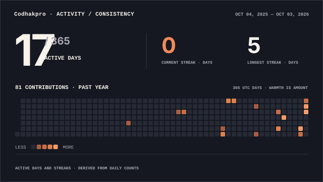

[README.md](https://github.com/user-attachments/files/32779166/README.md)<div align="center">


<br>

<a href="https://github.com/codhakpro"></a>
<a href="https://www.instagram.com/codhakpro/"></a>
<a href="https://www.linkedin.com/in/codhak-pro-a63491370/"></a>
<a href="https://x.com/OdufaluShedrack"></a>

</div>

## `whoami`

```text
┌──────────────────────────────────────────────────────────────┐
│  CODHAK PRO                                                   │
│                                                              │
│  Cybersecurity 🛡️  •  Python 🐍  •  AI/ML 🤖                 │
│                                                              │
│  Building quietly. Exploring what's beneath the surface.    │
└──────────────────────────────────────────────────────────────┘
```

<div align="center">

### `current_focus`

🛡️ **Cybersecurity** &nbsp; • &nbsp; 🤖 **AI / ML** &nbsp; • &nbsp; 💻 **Development**

<sub>Learning deeply, building consistently, and understanding how systems work beneath the surface.</sub>

</div>

## `tech_stack`

<div align="center">


<br>


<br>


<br>

<sub>🐍 Python &nbsp; ⚡ JavaScript &nbsp; 🌐 HTML &nbsp; 🎨 CSS &nbsp; 🔥 PyTorch &nbsp; 🧠 Scikit-learn</sub>

</div>

## `github_signal`

<div align="center">

</div>

## `contribution_trace`

<div align="center">

</div>

## `status`

```text
[ SYSTEM STATUS ]

> learning        : active
> building        : active
> exploring       : active
> curiosity       : unlimited
```

<div align="center">

### `let's_connect`

🛰️ **Open to collaboration, interesting ideas & meaningful connections.**

<br>

<a href="https://github.com/codhakpro">GitHub</a>
&nbsp; • &nbsp;
<a href="https://www.linkedin.com/in/codhak-pro-a63491370/">LinkedIn</a>
&nbsp; • &nbsp;
<a href="https://www.instagram.com/codhakpro/">Instagram</a>
&nbsp; • &nbsp;
<a href="https://x.com/OdufaluShedrack">X</a>

</div>

<br>

<div align="center">
<sub>⚡ Stay curious. Build quietly. Go deeper.</sub>
</div>
