<!-- ========================= HEADER ========================= -->

<div align="center">


<br>


<br><br>

<i>⚡ Code quietly. Build precisely.</i>

</div>

---

## 🕶️ `whoami`

```text
┌────────────────────────────────────────────────────┐
│                                                    │
│  CODHAK PRO                                        │
│                                                    │
│  > developer                                       │
│  > cybersecurity learner                           │
│  > machine learning explorer                       │
│  > builder                                         │
│                                                    │
│  I like understanding how things work —           │
│  then building, breaking and rebuilding them.      │
│                                                    │
└────────────────────────────────────────────────────┘
```

<br>

<table>
<tr>
<td width="33%" align="center">

### 🛡️ Cybersecurity

Ethical Hacking  
Security Testing  
Linux & Security Labs

</td>

<td width="33%" align="center">

### 🤖 AI / ML

Machine Learning  
PyTorch  
Model Building

</td>

<td width="33%" align="center">

### 💻 Development

Python  
Web Development  
Automation

</td>
</tr>
</table>

---

## 🧠 `// current_focus`

<div align="center">

🔐 **Security** &nbsp; • &nbsp; 🤖 **AI / ML** &nbsp; • &nbsp; 🐍 **Python** &nbsp; • &nbsp; 🌐 **Web**

<br><br>

<i>Learning deeply. Building consistently. Exploring what's beneath the surface.</i>

</div>

---

## ⚙️ `// tech_stack`

<div align="center">


<br>


<br>


<br><br>

<sub>🐍 Python &nbsp; ⚡ JavaScript &nbsp; 🌐 HTML &nbsp; 🎨 CSS &nbsp; 🔥 PyTorch &nbsp; 🧠 Scikit-learn</sub>

</div>

---

# 📡 `// github_signal`

<div align="center">

### 📊 LIVE ACTIVITY





<br><br>

<i>Activity updates automatically through GitHub Actions.</i>

</div>

---

## 🐍 `// contribution_trace`

<div align="center">


</div>

---

## 🌑 `// status`

```text
[ SYSTEM STATUS ]

● CYBERSECURITY      learning
● MACHINE LEARNING   building
● PYTHON             active
● WEB DEVELOPMENT    exploring
● CODE               always running

> status: ONLINE
```

---

## 🤝 `// let's_connect`

<div align="center">

<a href="https://www.linkedin.com/in/codhak-pro-a63491370/">

</a>

<a href="https://x.com/OdufaluShedrack">

</a>

<a href="https://www.instagram.com/codhakpro/">

</a>

<a href="https://github.com/codhakpro">

</a>

<br><br>

### 🛰️ Open to collaboration, interesting ideas & meaningful connections.

<i>Always interested in building, learning, and exploring something new.</i>

</div>

---

<div align="center">


<br>

<i>“There is always more beneath the surface.”</i>

<br><br>

<code>01000011 01001111 01000100 01001000 01000001 01001011</code>

<br><br>

<b>CODHAK PRO</b>

</div>
